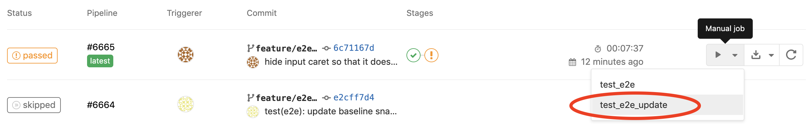

### E2E tests

Currently we can't run e2e tests in headless mode. This is due to limitations in headless Chromium that makes it
impossible to render certain models in PlayCanvas. Headless also seems less performant than headful when using WebGL.

Please refrain from interacting with your computer while running the e2e tests as it may affect the test result.

⚠️ Note that the snapshot results may vary depending on the hardware/OS the tests are run on. This is mainly due to
hardware and system specific settings that affect web and WebGL rendering.
**The E2E tests are intended to run in Docker in a CI environment where the snapshot result will be consistent.**
Currently the project is set up to work with GitLab CI using a Windows runner.

#### Run on GitLab CI

E2E tests will automatically run on GitLab CI. If they fail, the snapshot diff output will be saved as an artifact and
can be viewed/downloaded via the GitLab CI web GUI.


If the tests fail due to an expected or intentional diff, the baseline snapshot should be updated by manually triggering
job `test_e2e_update` in the GitLab CI web GUI. This will run the tests again with the `--updateSnapshot` argument and
automatically commit the updated snapshots to the same branch.



#### Run on local machine

⚠️ Don't expect results to match exactly with baseline, as explained above.

```bash
npm run test:e2e
```

Runs all e2e tests once.

```bash
npm run test:e2e-watch
```

Launches the e2e test runner in watch mode.

```bash
npm run test:e2e-update
```

Runs e2e tests with the `--updateSnapshot` argument, automatically updating the snapshot baseline from the test result.
